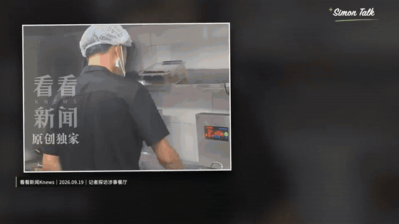

# simontalk-investigation

一套**不露脸商业 / 消费调查长片**的完整生产流程，以 [Claude Code skill](https://docs.anthropic.com/en/docs/claude-code) 的形式开源。给 AI 智能体一句「帮我做关于 XXX 的视频」，它跑完调查、写稿、配音、找素材、Remotion 合成、混音、封面和八平台文案，出一条 10 分钟以上的横屏成片。

它来自一个每天更新 2 到 3 条的真实账号。文档里的数字都是实测，每条规则都对应一次翻车。配套文章：

- 上篇《AI 日更 3 条深度长片，单条 70 万播放：完整工作流》：选题方法、平台经验、品牌投诉怎么扛
- 下篇《百万播放的 AI 长片，流程全部开源：一句话出 10 分钟成片》：本仓库的逐环节说明

## 先看样片

**▶️ [assets/sample-preview.mp4](assets/sample-preview.mp4)**（点进去在 GitHub 页面里直接播放，60 秒，960p）。这是一条正式发布成片《预制菜明示》的前 60 秒，原片 10 分 11 秒。



画面里的东西全在文档里有规则：新闻原片做主体并带白描边、证据截图做成带纸片阴影和小角度倾斜的卡片、每个镜头左下角标来源和日期、右上角固定字标、整句同步字幕。

## 流程

```
调查写稿 → 火山 TTS 配音（逐字时间戳）→ 逐段素材覆盖表 → Remotion 合成
    → FFmpeg 侧链闪避混音 → 机器验收 → 3:4 / 4:3 封面 → 八平台文案 + 校验
```

几条核心设计：

- **事实链先于稿件。** 每条判断有出处和日期，同一份记录既是来源台账也是被投诉时的申诉材料。
- **字幕时间戳直接来自 TTS。** 火山 `enable_subtitle` 返回每个字的起止毫秒，字幕对齐是数据处理，不跑语音识别。
- **真实动态影像不够不开始渲染。** 合成前必须先出逐段素材覆盖表，缺口段落先补素材。
- **六种叙事类型轮换，连续两期不重样。** 账目、代价、规则、过程、对照、身份，各自对应不同的 MG 形态。
- **时间预算写死。** 花字、短句、证据截图各自有最短纯阅读时间，进出场动画不算在内。
- **发布文案过校验脚本。** 平台顺序、字段、字数、章节，超一个字不交付。

## 仓库内容

| 路径 | 说明 |
| --- | --- |
| `SKILL.md` | 技能入口，AI 读这个 |
| `references/` | 各环节规则：叙事类型、写稿与素材、拼贴视觉、品牌与时间预算、封面与文案、流程手册、目录结构、验收 |
| `assets/SimonTalkBrand.jsx` | Remotion 品牌字标组件 |
| `assets/brand-stamp.py` | 封面字标固定合成：右上角，宽 22%，右距 4%，上距 3% |
| `assets/check-publish-copy.py` | 八平台文案校验 |
| `assets/publishing-reference/` | 文案模板和两张参考封面 |
| `scripts/tts.mjs` `scripts/tts-s20.mjs` | 火山 TTS 合成，1.2 倍速，带逐字时间戳与缓存 |
| `scripts/make-sentences.py` | 口播稿切句 |
| `scripts/subtitles-volc.py` | 逐字时间戳生成字幕 |
| `scripts/mix-bgm.sh` | 旁白响度归一后混入侧链闪避配乐，视频流不重编码 |
| `scripts/clipcheck.py` `scripts/qa.py` | 素材抽帧精查、成片机器验收 |
| `template/remotion/` | 最小 Remotion 参考工程，含时间轴、字体和一段样例素材 |
| `video-common/` | 账号无关的公共工序：事实核查、封面验收、平台文案机制、交付验收、合规自查 |

## 环境

| 依赖 | 版本 |
| --- | --- |
| Node.js | 18 以上 |
| Remotion | 4.0.508，固定 |
| React | 19.2.8，固定 |
| FFmpeg、yt-dlp | Homebrew 安装 |
| Python 3 + Pillow | 封面字标、验收脚本，`pip3 install pillow` |
| 字体 | SignPainter（macOS 自带，Windows 需单独安装）、Noto Sans SC（已在 template 内） |

Remotion 和 React 版本不要升。升级后出现过动画节奏错乱、布局漂移和黑帧，固定这组版本后全部消失。

火山引擎凭证放在仓库根目录 `.env`，字段见 `.env.example`。仓库不附带配乐，`scripts/mix-bgm.sh` 默认读 `assets/bgm.mp3`，自备一段无版权音乐。

## 使用

1. 把整个目录放进你的 AI 工具的 skills 目录（Claude Code 是 `~/.claude/skills/simontalk-investigation`），或在对话里直接引用 `SKILL.md`。
2. 配好 `.env` 和上表环境。
3. `cd template/remotion && npm install`，确认 `npm run still` 能出一帧。
4. 对 AI 说「帮我做一条关于 XXX 的视频」。

AI 会按 `SKILL.md` 走完全流程。中途任何阶段都能停下人工介入。

### 脚本要复制到工程目录里跑

`scripts/` 下的脚本不是在仓库目录里直接运行的。每期视频是一个独立工程（目录约定见 `references/project-layout.md`），脚本按 **自身所在位置** 找相对路径，所以要先复制进工程的 `work/production/`，再在那里执行：

| 脚本 | 复制到 | 旁边要有 |
| --- | --- | --- |
| `tts.mjs` + `lib/`、`tts-s20.mjs` | `work/production/` | 工程根目录 `.env` |
| `make-sentences.py` | `work/production/` | 口播稿 markdown（作为参数传入），输出 `sentences.json` |
| `subtitles-volc.py` | `work/production/` | `audio-manifest-s20.json`、`renderer/timeline.json` |
| `clipcheck.py`、`qa.py` | `work/production/` | `renderer/timeline.json`、`renderer/public/assets/`、`renders/` |
| `mix-bgm.sh` | `work/production/` | `renderer/public/narration.wav`、`assets/bgm.mp3` |
| `assets/SimonTalkBrand.jsx` | `work/production/renderer/` | Remotion 工程 |
| `assets/brand-stamp.py`、`assets/check-publish-copy.py` | 不用复制 | 传入封面图 / 文案文件路径即可 |

直接在仓库根目录跑 `qa.py`、`mix-bgm.sh` 之类会报找不到 `renderer/...`，这是预期行为，不是脚本坏了。`template/remotion/` 只是一个能出帧的最小参考，正式工程按上面的目录另建。

## 改成你自己的账号

- 品牌：`assets/SimonTalkBrand.jsx` 改字标，`references/brand-and-visual.md` 改强调色和时间预算，`assets/brand-stamp.py` 改字标位置。
- 选题范围与口吻：`references/editorial-and-materials.md`、`references/narrative-modes.md`。
- 平台集合与字数限制：`assets/check-publish-copy.py`、`assets/publishing-reference/`。
- 封面提示词用的是 [gbro-cover-design](https://github.com/pyang5166/gbro-cover-design)，标题公式和开场诊断用的是 [dbskill](https://github.com/dontbesilent2025/dbskill)，两者单独安装。

## 边界

- 本仓库只到成片和发布包，不做自动公开发布。
- 引用新闻视频与品牌官方图用于评论和分析，标明来源；AI 生成的概念图在画面上标注。
- 点名品牌的内容，每条判断都要能在来源台账里找到出处。

## License

MIT
